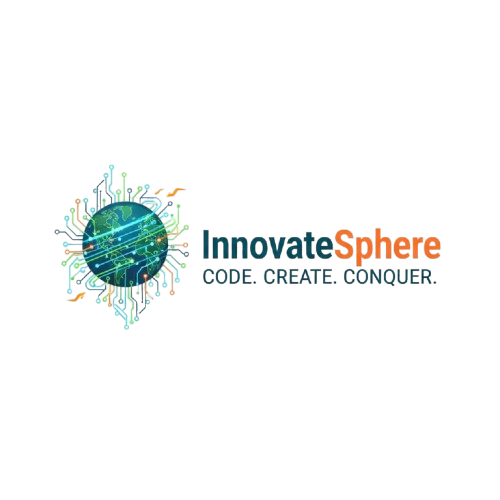

# InnovateSphere - Hackathon 2025



**🔗 Live Website:** [https://innovatesphereaissmscoe.netlify.app/](https://innovatesphereaissmscoe.netlify.app/)

## 🚀 About InnovateSphere

InnovateSphere is an intensive hackathon event where brilliant minds come together to create groundbreaking solutions. This event provides a platform for innovators, developers, and creative thinkers to code, collaborate, and compete while pushing the boundaries of technology.

**Event Details:**
- 📅 **Date:** 29th & 30th September 2025
- 📍 **Venue:** AISSMS College of Engineering
- 👥 **Team Size:** Maximum 4 Members (Individual participation allowed)
- 🏆 **Prizes:** 
  - Winner: ₹5000
  - 1st Runner-up: ₹3000

## ✨ Features

- **Interactive Event Website:** Modern, responsive design with animated elements
- **Multiple Problem Domains:** Six diverse categories covering various technological challenges
- **Winner Announcement System:** Dynamic popup with fireworks animation
- **Event Flow Visualization:** Comprehensive timeline and schedule display
- **Sponsor Showcase:** Dedicated section highlighting event sponsors
- **Registration Integration:** Direct link to registration portal
- **Mobile Responsive:** Optimized for all device sizes
- **Downloadable Resources:** Access to PPT format and event materials

## 🎯 Problem Domains

InnovateSphere 2025 focuses on six key domains:

### 1. Education and Skill Development
- AI tutor for personalized learning
- Interactive language learning games
- Skill assessment platforms
- Gamified learning experiences

### 2. Automation and Hardware Simulation
- IoT-based smart home systems
- Automated warehouse management
- Robotics process automation
- Hardware simulation tools

### 3. Creative AI and Generative Tech
- AI-powered content generation
- Generative art platforms
- Music composition tools
- Creative design assistants

### 4. Social Well-being and Healthcare
- Mental health monitoring systems
- Telemedicine platforms
- Personalized health tracking
- Preventive care solutions

### 5. Open Innovation
- Open-ended problem solving
- Cross-domain innovations
- Novel technological solutions
- Creative implementations

### 6. Other Events
- Community engagement activities
- Treasure hunts
- Gaming competitions
- Special events and workshops

## 💻 Software Requirements

### Required Software
- **Web Browser:** 
  - Google Chrome (version 100+)
  - Mozilla Firefox (version 100+)
  - Microsoft Edge (version 100+)
  - Safari (version 15+)
  - Any modern browser with HTML5, CSS3, and ES6+ JavaScript support
- **Text Editor/IDE** (for development):
  - Visual Studio Code
  - Sublime Text
  - Atom
  - WebStorm
  - Any modern code editor

### Optional Development Tools
- **Version Control:**
  - Git (for version control)
  - GitHub Desktop (optional GUI)
- **Local Server** (for testing):
  - Python HTTP Server (`python -m http.server`)
  - Node.js HTTP Server (`npx http-server`)
  - Live Server extension for VS Code
  - XAMPP/WAMP (for full stack development)

## 🖥️ Hardware Requirements

### Minimum Requirements (For viewing the website)
- **Processor:** Any modern processor (2015 or newer)
- **RAM:** 2 GB
- **Storage:** 100 MB free space
- **Display:** 1280x720 resolution (HD)
- **Internet:** Stable internet connection (2 Mbps minimum for streaming content)

### Recommended Requirements (For development)
- **Processor:** Intel Core i5 / AMD Ryzen 5 (2020 or newer)
- **RAM:** 8 GB or more
- **Storage:** 2 GB free space (for development tools and dependencies)
- **Display:** 1920x1080 resolution (Full HD) or higher
- **Internet:** High-speed connection (10 Mbps or higher recommended)

### For Hackathon Participants
- **Laptop/Desktop:** Required for development work
- **Webcam:** For virtual participation (if applicable)
- **Microphone:** For presentations and communication
- **Power Supply:** Backup power or fully charged devices

## 📦 Installation and Setup

### Quick Start

1. **Clone the Repository**
   ```bash
   git clone https://github.com/NerkarVedant/InnovateSphereWebsite.git
   cd InnovateSphereWebsite
   ```

2. **Open in Browser**
   - Simply open `index.html` in your web browser
   - Or use a local server for better experience

### Using a Local Server

**Option 1: Python HTTP Server**
```bash
# Python 3
python -m http.server 8000

# Python 2
python -m SimpleHTTPServer 8000
```
Then visit: `http://localhost:8000`

**Option 2: Node.js HTTP Server**
```bash
# Install http-server globally
npm install -g http-server

# Run server
http-server -p 8000
```
Then visit: `http://localhost:8000`

**Option 3: VS Code Live Server**
1. Install "Live Server" extension in VS Code
2. Right-click on `index.html`
3. Select "Open with Live Server"

## 🗂️ Project Structure

```
InnovateSphereWebsite/
├── index.html                 # Main landing page
├── flow.html                  # Event flow and timeline
├── education.html             # Education domain problems
├── automation.html            # Automation domain problems
├── creative.html              # Creative AI domain problems
├── healthcare.html            # Healthcare domain problems
├── open.html                  # Open innovation problems
├── otherevents.html          # Other events information
├── SPHERELOGO.png            # InnovateSphere logo
├── AISSMSLOGO.png            # College logo
├── KasnetLogo.jpg            # Sponsor logo
├── MonarchLogo.jpg           # Sponsor logo
├── RekhaLogo.jpg             # Sponsor logo
├── ALL.jpg                   # Event image
├── BGMIPhoto.jpg             # Gaming event image
├── TreasureHuntPhoto.jpg     # Treasure hunt image
├── InnovateSphere_ppt_format.pptx  # Event presentation
└── README.md                 # This file
```

## 🛠️ Technologies Used

### Frontend
- **HTML5:** Structure and semantic markup
- **CSS3:** 
  - Flexbox and Grid layouts
  - CSS animations and transitions
  - Gradient backgrounds
  - Media queries for responsiveness
- **JavaScript (Vanilla):**
  - DOM manipulation
  - Event handling
  - Animation controls
  - Timer and countdown functionality

### External Resources
- **Google Fonts:**
  - Orbitron (for headings)
  - Inter (for body text)
- **Font Awesome 6.4.0:** Icon library
- **CDN Resources:** For fast content delivery

### Design Features
- Responsive design (Mobile, Tablet, Desktop)
- Interactive animations
- Particle effects
- Fireworks animation for winner announcement
- Smooth scroll effects
- Hover effects and transitions
- Dynamic countdown timer

## 🎨 Key Features Explained

### Winner Announcement System
The website includes a sophisticated winner announcement popup that features:
- Animated entrance with rotation effects
- Dynamic fireworks generation
- Confetti animations
- Gradient text effects
- Responsive design

### Event Flow Page
Comprehensive timeline showing:
- Registration process
- Problem statement release
- Hackathon phases
- Judging criteria
- Winner announcement

### Problem Statement Pages
Each domain has a dedicated page with:
- Detailed problem descriptions
- Solution requirements
- Evaluation criteria
- Back navigation to main page

## 📱 Usage

### For Visitors
1. Open `index.html` to view the event website
2. Browse through different sections:
   - Event details and schedule
   - Problem domains
   - Registration link
   - Sponsor information
3. Click on domain cards to view detailed problem statements
4. Access the event flow page for timeline information
5. Download PPT format for offline reference

### For Participants
1. Visit the website to understand event details
2. Review problem statements in your area of interest
3. Click "Register Now" to sign up for the hackathon
4. Download the PPT format for reference
5. Check the event flow for schedule and deadlines

### For Organizers
1. The website is ready to deploy
2. Update the registration link in `index.html` if needed
3. Modify winner information when results are announced
4. Update sponsor logos and information as required

## 🎯 Event Registration

Registration is available through the integrated registration button on the homepage. Participants can:
- Register as individuals or teams (max 4 members)
- Choose their preferred problem domain
- Submit their project proposals
- Track their registration status

## 🏆 Winners

The website features a winner announcement system that displays:
- **Winner:** Team "DMS"
- **1st Runner-up:** Team "Care Connect"
- **2nd Runner-up:** Team "SkillSync"

## 🤝 Sponsors

InnovateSphere 2025 is supported by:
- AISSMS College of Engineering
- Kasnet
- Monarch
- Rekha & Associates

## 📧 Contact Information

**Organized by:**
AISSMS College of Engineering

For queries and information:
- Visit the event website
- Check the registration portal
- Contact event coordinators through official channels

## 🙏 Acknowledgments

We extend our heartfelt gratitude to:
- All sponsors for their trust and unwavering support
- AISSMS College of Engineering for hosting the event
- Participants for their enthusiasm and innovation
- Organizing committee for their dedication

## 📄 License

This website is created for InnovateSphere Hackathon 2025 event purposes.

## 🔗 Links

- **Registration Portal:** [Register Here](https://scan.page/qukEy5)
- **Event Website:** Main repository
- **PPT Format:** Available for download on the website

---

**&copy; 2025 InnovateSphere Hackathon. Organized by AISSMS College of Engineering.**

*Built with 💜 for innovation and collaboration*
